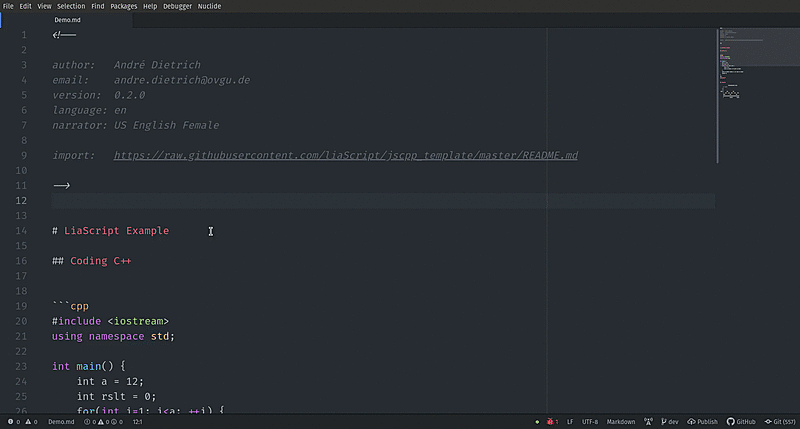

# Liascript-Preview

A preview-plugin for [LiaScript](https://LiaScript.github.io), an extended
markdown notation that is intended to be used for interactive online-course
generation.

https://atom.io/packages/liascript-preview

## Install

This has been tested on Linux and Windows.

### Command Line

Install Atom 1.22 or newer

In the terminal, install the package via apm:

    `apm install liascript-preview`

### GUI

1. Install Atom 1.22 or newer
2. Launch Atom
3. Open Settings View using Cmd+, on macOS or Ctrl+, on other platforms
4. Click the Install tab on the left side
5. Enter `liascript-preview` in the search box and press Enter
6. Click the "Install" button that appears

## Features

* Autoreload on save
* Toggle Preview
* History navigation
* Resizing
* Syncing in both directions via double-clicking

<!--width= "100%" -->

### Keyboard - Shortcuts

| Shortcut  | Action                                          |
|-----------|-------------------------------------------------|
| Alt+l     | Toggle preview                                  |
| F5        | Reload preview                                  |
| Ctrl+s    | Save Markdown and update preview                |
| Alt+Left  | Go back in the browser history                  |
| Alt+Right | Go forward in the browser history               |
| Ctrl++    | Zoom-in with 10% steps                          |
| Ctrl+-    | Zoom-out with 10% steps                         |
| Ctrl+0    | Reset zoom to original (100%)                   |
| Ctrl+r    | Reset all stored settings, codes, quizzes, etc. |
| Ctrl+n    | Open LiaScript in browser window                |

## Related Projects

It is recommended to install also:

[liascript-snippets](https://atom.io/packages/liascript-snippets)

A collection of shortcodes for mor efficient course generation.
